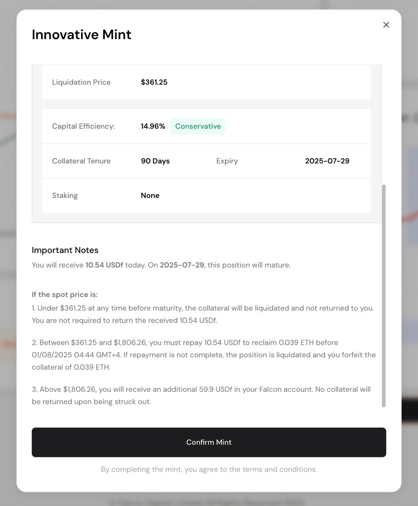

# FF Tokenomics

<figure><figcaption></figcaption></figure>

* **Ecosystem: (35%):** This will be allocated for ecosystem developments and success, including future airdrops, ecosystem growth fund, RWA adoption, and cross-chain integrations.
* **Foundation (24%):** This will be allocated for the foundation's growth, including risk management and audits.
* **Core Team & Early Contributors (20%):** This is allocated to the core development team and early contributors to the protocol who built Falcon Finance from zero to one. 1-year cliff and 3-year vesting will be implemented.
* **Community Airdrops & Launchpad Sale (8.3%):** This will be allocated to reward the early supporters and long-term users of Falcon Finance, including Falcon Finance’s Miles Program, Buidlpad community sale, and Kaito Yap2Fly campaign.
* **Marketing (8.2%):** This will be allocated to sustained marketing efforts designed to amplify visibility, foster ecosystem adoption, and position Falcon Finance for long-term growth.
* **Investors (4.5%):** This will be allocated to investors who have supported Falcon Finance since the early stages. 1-year cliff and 3-year vesting will be implemented.
* TGE circulating supply calculation: 2.34B FF (23.4%) at launch
