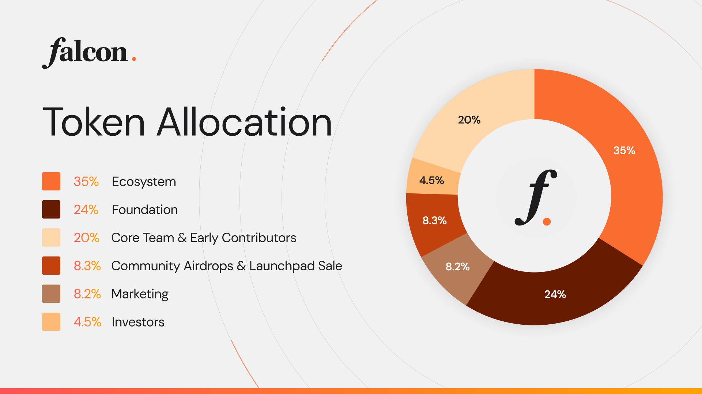

# Deposit

### Supported Collateral Types:

* **Stablecoins:**&#x20;
  * USDT, USDC, FDUSD​
* **Non-Stablecoin Assets:**&#x20;
  * BTC, ETH, TON, NEAR, XRP, NEAR, DEXE, BEAMX, MOVE, POL, EOS, TRX, SOL, FET, COTI

_\*For any other tokens, please reach out to **support on falcon.finance** for assistance._

### Steps:

1. **Connect Wallet:**&#x20;
   * Make sure your digital wallet (e.g., MetaMask, Trust Wallet) is connected to the **Falcon Finance** platform.

<figure><figcaption>
"Connect Wallet" on the right-top of the page
</figcaption></figure>

<figure><figcaption></figcaption></figure>

2. **Navigate to Deposit Section:**&#x20;
   * Access the "Deposit" area on the platform.

<figure><figcaption></figcaption></figure>

3. **Select Collateral Type:**&#x20;

* Choose the asset (token) you want to deposit. You can deposit through an exchange or directly from your wallet.

4. **Enter Amount:**&#x20;
   * Specify the amount of the asset you wish to deposit.

<figure><figcaption>
Deposit 50,000 USDT
</figcaption></figure>

<figure><figcaption>
Deposit 10 ETH
</figcaption></figure>

5. **Approve Transaction:**&#x20;
   * Confirm and authorize the transaction within your wallet (e.g., MetaMask).
6. **Confirm Deposit:**&#x20;
   * Finalize the deposit and await confirmation of the transaction. Once confirmed, you will see the deposited assets in your **Falcon Wallet** under "Available Assets."

<figure><figcaption></figcaption></figure>

_Example:_

* Depositing 5&#x30;**,000 USDT & 10 ETH** with USD Value.​
* Deposit amount will be in your falcon wallet - available assets

### **Notice:**

**Recommended Next Step:** It’s recommended to mint your deposited amount. This will allow you to fully utilize the assets within the Falcon Finance platform.

Here’s the link to proceed with minting your deposit:\
[**Mint Link**](https://falcon.finance)\
For any assistance or inquiries regarding the minting process, please reach out to **Falcon Finance support** at the same link.
