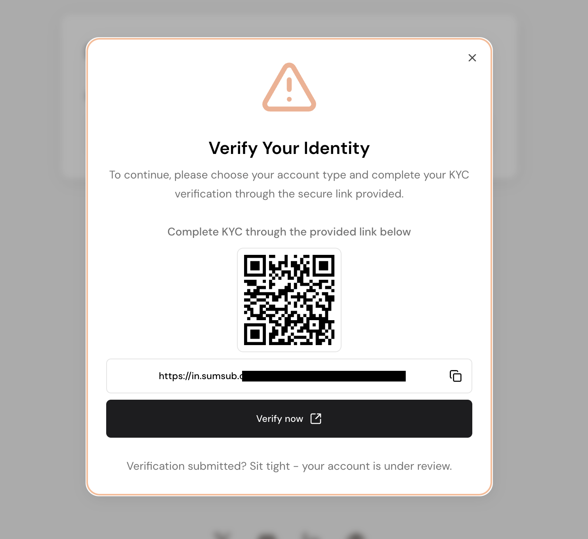
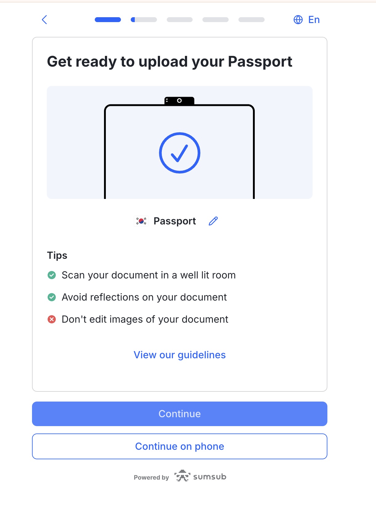

# Know Your Customer (KYC)

Prior to depositing, individual users will be required to undergo KYC (Know Your Customer) processes respectively. These are regulatory processes intended to verify the identity of Falcon's users, ensuring adherence to Anti-Money Laundering (AML) regulations and maintaining secure and compliant transaction practices.

### KYC Process

New users to Falcon may initiate this process by starting a [deposit](https://app.falcon.finance/transfer/deposit), [withdrawal](https://app.falcon.finance/transfer/withdraw), [mint](https://app.falcon.finance/swap/mint) or [redeem](https://app.falcon.finance/swap/redeem) action, at which a prompt for the user to choose their account type will appear.\
Users select 'Individual' and click the 'Get my KYC/KYB link'. They will then receive a unique QR code and link to proceed.

<figure><figcaption></figcaption></figure> <figure><figcaption></figcaption></figure>

Throughout the process, users will be required to provide a range of personal information and data. These include:

* Country of Residence
* Email
* Telegram Handle
* Identity Document&#x20;
  * Supported document types vary across different issuing countries

<figure><figcaption></figcaption></figure> <figure><figcaption></figcaption></figure>

* Proof of Address
  * Documents submitted must clearly state users' full legal names, residential address, and be no older than 3 months
  * Examples include:
    * Bank statements
    * Telecom/Utility/Tax bills
    * Voter registration documents
    * Lease agreements
    * Official government-issued letters
* Employment Status
* Source of Funds
* Political Exposure

The entire KYC verification review process ranges from a few minutes to 5 business days. Do note that verification times may increase during periods of high market demand or increased verification volumes.

In the case where users' applications have been rejected, they may be required to resubmit specific documents or provide additional information. Users are encouraged to review feedback provided carefully and proceed as instructed.

However, if submissions still do not meet Falcon's regulatory requirements, rejection decisions will be final. If users have any subsequent questions or require assistance, they can reach out at support@falcon.finance.&#x20;
